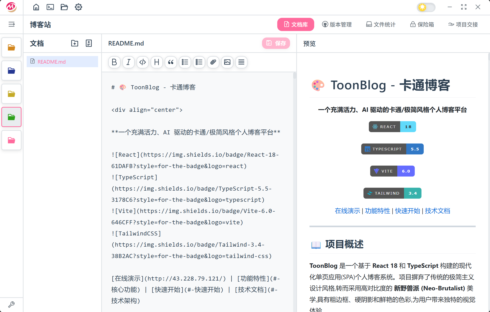

# ProManager - 项目管理应用

<p align="center">
  
</p>

<p align="center">
  一款功能丰富的本地项目管理桌面应用
</p>

<p align="center">
  <a href="https://github.com/motoryang/pm-app/releases">
    
  </a>
  <a href="https://github.com/motoryang/pm-app/blob/main/LICENSE">
    
  </a>
</p>

## UI展示



## 功能特性

### 项目管理
- 创建和管理多个项目
- 自定义项目颜色标识
- 快捷方式功能，快速访问常用资源

### 文档管理
- Markdown 文档编辑和预览
- 代码高亮显示
- 图片插入支持
- 最近文档快速访问

### Git 集成
- 查看仓库状态
- 分支管理和切换
- 提交历史查看
- 文件暂存和提交

### 文件分析
- 项目目录结构分析
- 代码统计功能

### 密码保险库
- 安全存储敏感信息
- 主密码加密保护
- 密码生成器

### 项目交接
- 导出项目交接文档
- 支持多种格式

### 系统功能
- 自动更新检测
- 后台静默更新
- 单实例运行
- 系统托盘支持
- 深色/浅色主题

## 技术栈

- **前端框架**: Vue 3 (Composition API)
- **状态管理**: Pinia
- **桌面框架**: Tauri 2.x
- **后端语言**: Rust
- **数据库**: SQLite
- **构建工具**: Vite

## 安装

### 下载安装包

前往 [Releases](https://github.com/motoryang/pm-app/releases) 页面下载对应平台的安装包：

- **Windows**: `.exe` 或 `.msi` 安装包
- **macOS**: `.dmg` 安装包
- **Linux**: `.deb` 或 `.AppImage`

### 从源码构建

#### 前置要求

- [Node.js](https://nodejs.org/) >= 18
- [Rust](https://www.rust-lang.org/) >= 1.70
- [Tauri CLI](https://tauri.app/)

#### 构建步骤

```bash
# 克隆仓库
git clone https://github.com/motoryang/pm-app.git
cd pm-app

# 安装依赖
npm install

# 开发模式运行
npm run tauri:dev

# 构建生产版本
npm run tauri:build
```

## 项目结构

```
pm-app/
├── src/                      # 前端源码
│   ├── assets/              # 静态资源
│   ├── components/          # Vue 组件
│   │   ├── layout/         # 布局组件
│   │   ├── settings/       # 设置相关组件
│   │   ├── shortcuts/      # 快捷方式组件
│   │   ├── ui/             # 通用 UI 组件
│   │   └── update/         # 更新相关组件
│   ├── composables/         # Vue Composables
│   ├── stores/              # Pinia 状态管理
│   ├── views/               # 页面视图
│   ├── App.vue              # 根组件
│   └── main.js              # 入口文件
├── src-tauri/               # Tauri 后端
│   ├── src/                 # Rust 源码
│   │   ├── commands/       # Tauri 命令
│   │   └── lib.rs          # 主入口
│   ├── migrations/          # 数据库迁移
│   ├── capabilities/        # 权限配置
│   ├── Cargo.toml           # Rust 依赖
│   └── tauri.conf.json      # Tauri 配置
├── .github/workflows/       # GitHub Actions
└── package.json             # Node.js 依赖
```

## 开发

```bash
# 启动开发服务器
npm run dev

# 启动 Tauri 开发模式
npm run tauri:dev

# 构建前端
npm run build

# 构建 Tauri 应用
npm run tauri:build
```

## 推荐 IDE 配置

- [VS Code](https://code.visualstudio.com/)
- [Vue - Official](https://marketplace.visualstudio.com/items?itemName=Vue.volar) 扩展
- [Tauri](https://marketplace.visualstudio.com/items?itemName=tauri-apps.tauri-vscode) 扩展
- [rust-analyzer](https://marketplace.visualstudio.com/items?itemName=rust-lang.rust-analyzer) 扩展

## 贡献指南

欢迎提交 Issue 和 Pull Request！

1. Fork 本仓库
2. 创建功能分支 (`git checkout -b feature/AmazingFeature`)
3. 提交更改 (`git commit -m 'Add some AmazingFeature'`)
4. 推送到分支 (`git push origin feature/AmazingFeature`)
5. 创建 Pull Request

## 许可证

本项目基于 MIT 许可证开源。

## 致谢

- [Tauri](https://tauri.app/) - 桌面应用框架
- [Vue.js](https://vuejs.org/) - 前端框架
- [Icon Park](https://iconpark.oceanengine.com/) - 图标库
